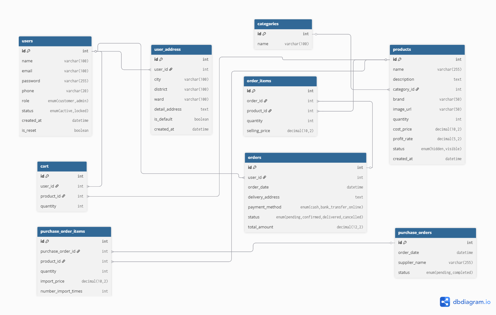

# 🛒 E-Commerce Web Application - Hệ Thống Quản Lý Bán Hàng Trực Tuyến



## 📖 Giới thiệu
Đây là một hệ thống Website Thương Mại Điện Tử hoàn chỉnh được xây dựng trên nền tảng **PHP & MySQL** kết hợp với **HTML, CSS, JavaScript** thuần. Hệ thống được thiết kế với hai phân hệ chính: Giao diện người dùng (Front-end) thân thiện để mua sắm và Giao diện quản trị (Back-end) mạnh mẽ giúp chủ cửa hàng quản lý toàn diện từ sản phẩm, danh mục, đơn hàng cho đến tồn kho và người dùng.

Dự án này đặc biệt chú trọng vào luồng quản lý tồn kho chặt chẽ, tính toán giá vốn theo phương pháp bình quân gia quyền và trải nghiệm tìm kiếm, lọc sản phẩm nâng cao của người dùng.

## ✨ Tính năng nổi bật

### 🛍️ Phân hệ Khách hàng (Front-end)
*   **Trang chủ & Cửa hàng:** Hiển thị danh sách sản phẩm trực quan, phân trang và load dữ liệu động (`SanPham.html`, `allsanpham1.php`).
*   **Tìm kiếm & Lọc nâng cao:** Tìm kiếm sản phẩm theo tên, khoảng giá, thương hiệu và danh mục (`timkiemyonex1.php`).
*   **Chi tiết sản phẩm:** Xem thông tin chi tiết, kiểm tra số lượng tồn kho theo thời gian thực trước khi thêm vào giỏ.
*   **Giỏ hàng & Thanh toán:** Quản lý giỏ hàng (`Giohang.php`), quy trình checkout mượt mà (`checkout.php`) và xác nhận đặt hàng thành công (`dathangthanhcong.php`).
*   **Quản lý tài khoản:** Đăng ký, đăng nhập (`login.html`, `register.html`), xem thông tin tài khoản và theo dõi lịch sử đơn hàng (`donhangcuaban.php`).

### ⚙️ Phân hệ Quản trị viên (Back-end / Admin)
*   **Dashboard:** Tổng quan thống kê hệ thống (`dashboard.php`).
*   **Quản lý Sản phẩm:** Thêm mới, chỉnh sửa, xóa và xem danh sách sản phẩm. Các trường như Giá vốn và Tồn kho được khóa (`readonly`) để bảo vệ tính toàn vẹn dữ liệu.
*   **Quản lý Danh mục:** Phân loại sản phẩm linh hoạt (`DanhMuc.php`, `ThemDanhMuc.php`).
*   **Quản lý Kho hàng:** Cốt lõi của hệ thống, quản lý phiếu nhập hàng (`FormPhieuNhap.php`), tính toán giá vốn bình quân và quản lý tồn kho chặt chẽ (`QuanLyTonKho.php`).
*   **Quản lý Đơn hàng:** Xem chi tiết đơn hàng, cập nhật trạng thái đơn hàng và phân loại (`QuanLyDonHang.php`, `Donhangphanloai.php`).
*   **Quản lý Người dùng:** Danh sách khách hàng và quản trị viên, thêm mới tài khoản từ trang admin.

## 💻 Công nghệ sử dụng
*   **Ngôn ngữ Backend:** PHP (Vanilla)
*   **Cơ sở dữ liệu:** MySQL (`test (5).sql`)
*   **Frontend:** HTML5, CSS3, JavaScript (Vanilla)
*   **Công cụ thiết kế:** Figma (`bản thảo figma.pdf`)
*   **Kiến trúc:** Client-Server

## 📁 Cấu trúc thư mục

```text
duanvipnhatthegioi/
│
├── assets/                 # Chứa tài nguyên tĩnh của dự án
│   ├── css/                # Các tệp định dạng CSS
│   ├── img/                # Hình ảnh chung của website
│   ├── js/                 # Chứa các script logic phía client (như validation.js)
│   ├── php/                # Các script PHP xử lý logic dùng chung
│   └── uploads/            # Thư mục lưu trữ hình ảnh sản phẩm được upload
│
├── pages/                  # Thư mục chứa toàn bộ giao diện và logic (Views/Controllers)
│   ├── AddProduct.php      # Form thêm sản phẩm
│   ├── EditProduct.php     # Form sửa sản phẩm
│   ├── QuanLyTonKho.php    # Quản lý kho hàng
│   ├── Giohang.php         # Logic giỏ hàng
│   ├── checkout.php        # Logic thanh toán
│   └── ...                 # Các trang chức năng khác
│
├── test (5).sql            # File script dump CSDL MySQL
├── so_do_db.png            # Hình ảnh sơ đồ quan hệ CSDL
└── bản thảo figma.pdf      # Bản phác thảo thiết kế UI/UX
```

## 🚀 Hướng dẫn cài đặt (Cục bộ / Localhost)

Để chạy dự án này trên môi trường local, bạn cần cài đặt **XAMPP** (hoặc WAMP/MAMP).

**Bước 1: Clone dự án**
Clone hoặc copy thư mục dự án vào thư mục `htdocs` của XAMPP:
```bash
C:\xampp\htdocs\do_an_web02\duanvipnhatthegioi
```

**Bước 2: Cài đặt Cơ sở dữ liệu**
1. Mở XAMPP Control Panel, khởi động **Apache** và **MySQL**.
2. Truy cập `http://localhost/phpmyadmin/`.
3. Tạo một cơ sở dữ liệu mới (ví dụ: `duan_ecommerce`).
4. Chuyển sang tab **Import**, chọn file `test (5).sql` nằm ở thư mục gốc của dự án và nhấn **Go** để thực thi.

**Bước 3: Cấu hình kết nối CSDL**
Tìm đến file kết nối cơ sở dữ liệu trong source code (thường nằm ở `assets/php/` hoặc các file include chung) và cập nhật các thông số cho phù hợp với localhost:
```php
$servername = "localhost";
$username = "root";
$password = ""; // Tùy thuộc vào thiết lập XAMPP của bạn
$dbname = "quebshop2"; // Tên CSDL bạn vừa tạo
```

**Bước 4: Chạy ứng dụng**
*   **Trang khách hàng:** Truy cập `http://localhost/do_an_web02/duanvipnhatthegioi/pages/SanPham.html`
*   **Trang quản trị:** Truy cập `http://localhost/do_an_web02/duanvipnhatthegioi/pages/admindangnhap.php`

## 🔒 Ghi chú về luồng Dữ liệu & Bảo mật
*   **Tồn kho & Giá vốn:** Không được phép chỉnh sửa trực tiếp thông qua chức năng sửa sản phẩm (`EditProduct.php`). Mọi thay đổi về số lượng và giá trị tồn kho bắt buộc phải thông qua luồng **Nhập hàng** để đảm bảo hệ thống kế toán chính xác.
*   **Validation:** Dữ liệu đầu vào ở các form (đăng ký, thanh toán, thêm sản phẩm) được kiểm tra chặt chẽ ở cả phía Client (JavaScript) và Server (PHP) để phòng ngừa lỗi và các lỗ hổng cơ bản.

## 📝 Giấy phép
Dự án được xây dựng phục vụ cho mục đích học tập và báo cáo đồ án.
